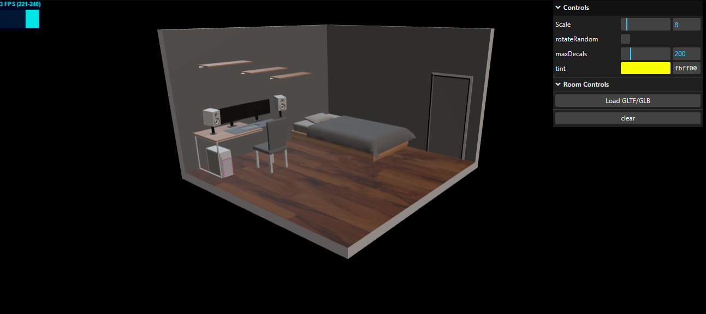
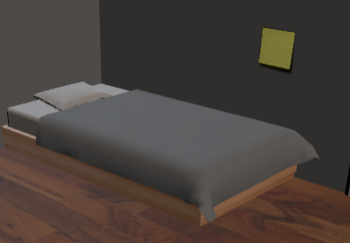
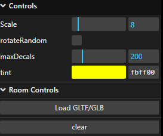

This is a simple project,
That has a lot of Reminders.

Just go to the link https://brennodatorre.github.io/cs460/FINAL/
and you should see the default room and option.

Have fun!

I just click to add a post-it note onto a mesh. 

The post-it can be re-sized, re-colored, and can have a random rotation.
The user can also upload any glb file that they want to use. 
The file will then be used as the object to be interacted with.

Made by Brenno Goncalves.

